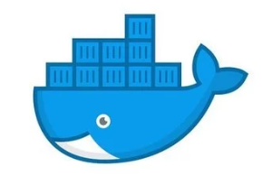

# Year 2019

- Jan : Ansible
  - Implementation

- Feb : 
  - ML/AI Analytics
    - Tensor Flow
    - Scikit learn
  - Apache Kafka
    - POC & Implementation
  - Reactive Spring

- Mar : Docker
  - Docker images for technologies
    - Scikit learn

- Apr : ML/AI Analytics
  - Potential Fraud detection

  [Docker images for reference](https://hub.docker.com/u/thinkforward)
